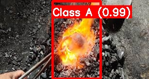
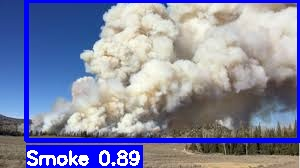

# 🔥 Fire & Smoke Detection & Fire Classification System

## 🧠 Overview

This project presents an **AI-powered real-time Fire and Smoke Detection System** combined with **Fire Type Classification (Class A–F)** using deep learning.

The system integrates:

* 🔍 **YOLO-based Object Detection** (Fire & Smoke)
* 🧠 **Image Classification Model** (Fire Type Recognition)

It works on both **images and videos**, making it suitable for real-world applications such as surveillance, industrial safety, and smart monitoring systems.

---

## 🚀 Features

* 🔥 Fire detection with bounding boxes
* 💨 Smoke detection (low-confidence optimized)
* 🧠 Fire classification (Class A–F)
* 🎥 Supports image & video input
* 📁 Automatic output saving with input name
* ⚡ Optimized pipeline (frame skipping + resizing)
* 📊 Confidence-based predictions

---

## 🏗️ System Architecture

Input (Image/Video)
↓
YOLO Detection (Fire/Smoke)
↓
Crop Fire Region
↓
Classification Model
↓
Final Output (Bounding Box + Fire Type)

---

## 📊 Detection Model Performance

| Model                    | Precision   | Recall      | mAP@50      | mAP@50-95   |
| ------------------------ | ----------- | ----------- | ----------- | ----------- |
| YOLOv10                  | 0.73374     | 0.66316     | 0.72558     | 0.42321     |
| YOLOv11                  | 0.75090     | 0.67504     | 0.74438     | 0.43646     |
| YOLOv9                   | 0.76532     | 0.70420     | 0.76331     | 0.44868     |
| YOLOv8(Final)            | **0.75512** | **0.71837** | **0.76748** | **0.45001** |

👉 Final model shows **best balance of precision & recall**

---

## 🧠 Classification Model Performance

### Training Summary (50 Epochs)

* Final Training Loss: **0.0205**
* Validation Loss: **0.0731**
* Top-1 Accuracy: **97.66%**
* Top-5 Accuracy: **100%**

### 📈 Key Observations

* Rapid convergence after **Epoch 10**
* Stable performance after **Epoch 30**
* Minimal overfitting (train ≈ validation loss)
* High classification confidence across classes

---

## 🔥 Classification Output

The classification model predicts fire types:

* Class A → Wood, Paper
* Class B → Flammable liquids
* Class C → Electrical fires
* Class D → Metals
* Class F → Cooking oils

### Example:

```
Fire (Class A) 0.43
```

* Class A → Predicted type
* 0.43 → Confidence score (43%)

---

## 🖼️ Sample Output

<p align="center">
  
  
</p>

---

## 🛠️ Tech Stack

* Python
* Ultralytics YOLO (v8/v9/v10/v11)
* OpenCV
* PyTorch

---

## ⚙️ Installation

```bash
pip install ultralytics opencv-python torch torchvision numpy
```

---

## ▶️ Usage

Run the pipeline:

```bash
python final_pipeline.py
```

Change input inside code:

```python
input_path = "your_image_or_video_path"
```

---

## 📂 Project Structure

```
Fire-Smoke-AI/
│
├── detection/
│     ├── final_pipeline.py
│     ├── codes/
│     └── outputs/
│
├── classification/
│     ├── raw_dataset/
│     └── split_dataset/
```

---

## ⚠️ Notes

* Dataset and trained models are excluded due to size limits
* You can retrain models using provided scripts

---

## 🎯 Applications

* CCTV Surveillance Systems
* Industrial Fire Safety
* Smart Home Monitoring
* Forest Fire Detection
* Robotics & Autonomous Systems

---

## 🧑‍💻 Author

**Guru Dinesh Reddy**

---

## 🔮 Future Improvements

* 📩 Telegram / Email alert system
* 📡 Real-time camera streaming
* 📱 Mobile app integration
* ⚡ Edge device deployment (Raspberry Pi, Jetson)

---

## 🛡️ Conclusion

This project demonstrates a **complete AI pipeline** combining detection and classification to improve fire safety systems.

> Early detection saves lives — this system enables faster and smarter response.

---
